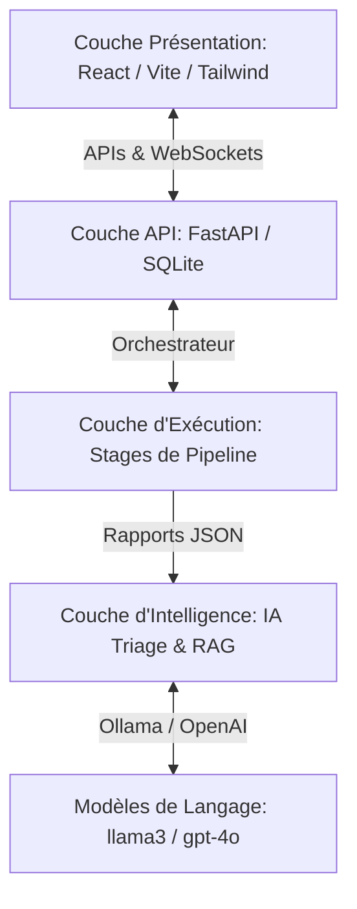
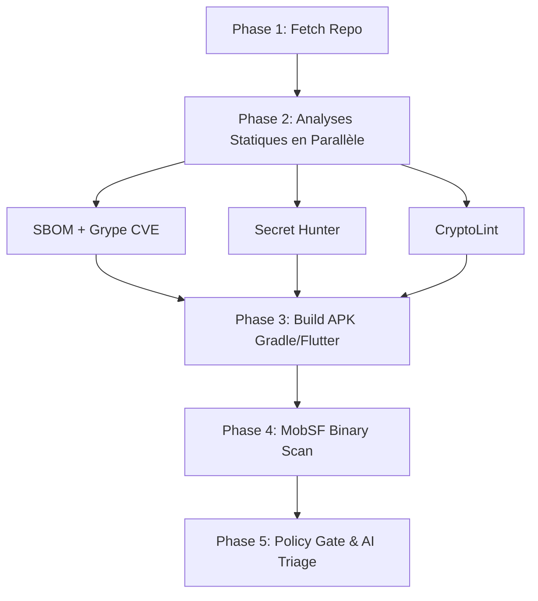

# Plateforme Mobile DevSecOps

[](https://doi.org/10.5281/zenodo.20318600)

## Aperçu
La **Plateforme Mobile DevSecOps** est un framework d'orchestration automatisé de bout en bout, conçu pour intégrer la sécurité directement dans le cycle de vie du développement d'applications mobiles (**Android, Flutter et React Native**). Inspirée de Jenkins Blue Ocean et entièrement conçue à partir de zéro, elle combine des outils d'analyse statique et binaire aux standards de l'industrie avec un tableau de bord interactif moderne et un système avancé de triage par Intelligence Artificielle (IA) locale ou distante.

Cette plateforme répond au besoin critique de vérification continue de la sécurité en fournissant des résultats concrets, en réduisant les faux positifs et le bruit grâce au regroupement sémantique par IA, et en garantissant la conformité avec la norme **OWASP Mobile Application Security Verification Standard (MASVS) v2.0**.

---

## Fonctionnalités Principales
- 🚀 **Orchestration Complète et Optimisée** : Exécution asynchrone et intelligente de 8 étapes de sécurité avec parallélisation de la phase d'analyse statique et mécanisme *Fail-Fast* pour bloquer les builds lents si des vulnérabilités critiques sont détectées.
- 💻 **Tableau de Bord Web Interactif** : Interface front-end moderne basée sur **React, Vite et Tailwind CSS**, offrant un suivi en temps réel via WebSockets, un historique complet des analyses, et des visualisations détaillées.
- 🤖 **Triage IA Sémantique (RAG)** : Intégration d'un modèle de langage local via **Ollama** (ou distant via l'API OpenAI) pour regrouper les vulnérabilités par cause racine, lier les failles aux contrôles de conformité **OWASP MASVS**, associer les identifiants **CWE**, et générer des fiches de remédiation exploitables par les développeurs.
- 📑 **Synthèse de Sécurité (Release Notes)** : Génération automatisée par l'IA de notes de sécurité de haut niveau évaluant le risque global avant la mise en production (évaluation "go/no-go").
- ⚙️ **Application de Policy-as-Code** : Portes de sécurité (*Policy Gates*) hautement configurables au format YAML pour bloquer ou avertir lors d'une version non conforme en fonction de seuils de sévérité personnalisés (`PASS`, `FAIL`, `WARN`).
- 📦 **Nomenclature Logicielle (SBOM)** : Génération automatisée d'inventaires de composants tiers conformes au format standard **CycloneDX v1.4** à l'aide de *Syft*, couplée à une analyse des vulnérabilités connues (CVE) via *Grype*.
- 🔑 **Chasseur de Secrets & Analyse Cryptographique** : Scanners personnalisés intégrés pour identifier les identifiants codés en dur (clés AWS, Google API, JWT, etc.) par analyse d'entropie et regex, et repérer les mauvaises pratiques cryptographiques (utilisation de MD5, SHA-1, DES, modes d'opération non sécurisés comme ECB, ou désactivation des vérifications TLS/SSL).
- 🛡️ **Intégration GitHub Statuses** : Notification automatisée de l'état du pipeline (`pending`, `success`, `failure`, `error`) directement sur les commits du dépôt GitHub concerné.
- 🔒 **Souveraineté des Données Hors Ligne** : Exécution entièrement conteneurisée et locale garantissant qu'aucun code source ni donnée sensible ne quitte le réseau privé de l'organisation.

---

## Architecture
Le système repose sur une architecture modulaire à quatre couches :



1. **Couche de Présentation (Front-end)**
   - **Technologie** : React, Vite, Tailwind CSS, Lucide React, WebSockets.
   - **Rôle** : Affiche les journaux d'exécution en direct, l'historique des analyses, la configuration interactive des politiques de sécurité (Policies), et les fiches de remédiation IA.
2. **Couche API & Données (Back-end)**
   - **Technologie** : Python, FastAPI, Uvicorn, SQLAlchemy, SQLite.
   - **Rôle** : Gère l'état et l'historique des analyses, distribue les événements en temps réel via WebSockets, et gère la base de données relationnelle locale (`devsecops.db`).
3. **Couche d'Exécution (Orchestrateur & Modules)**
   - **Technologie** : Python, Git CLI, Gradle Wrapper, Flutter CLI.
   - **Rôle** : Coordonne le cycle de vie du pipeline avec le chargement des politiques et le clonage.
   - **Modules** : `FetchRepoStage`, `SBOMStage` (Syft + Grype), `SecretHunterStage`, `CryptoLintStage`, `BuildAPKStage`, `MobSFStage`, `PolicyGateStage`, `AITriageStage`.
4. **Couche d'Intelligence (IA & RAG)**
   - **Technologie** : Ollama (modèle `llama3` local par défaut) ou API OpenAI.
   - **Rôle** : Récupère les données structurées des vulnérabilités, applique le moteur RAG contextualisé avec les standards OWASP MASVS, et génère des tickets de remédiation.

---

## Prérequis
- Environnement **Windows 10/11** ou **Linux/macOS**
- **Python 3.11** ou version ultérieure
- **Node.js (v18+)** et **npm**
- **Docker Desktop** (pour le déploiement multi-conteneurs de la stack)
- **Git** installé et configuré
- Optionnel : **SDK Android** configuré localement (si exécution hors Docker pour le build Gradle)

---

## Installation et Déploiement

### Déploiement Complet (Recommandé avec Docker Compose)

1. **Cloner le Dépôt**
   ```bash
   git clone https://github.com/Bellafrikh/devsecops-pipeline-mobile.git
   cd devsecops-pipeline-mobile
   ```

2. **Configurer l'Environnement**
   Copiez le fichier d'exemple pour créer votre fichier `.env` :
   ```bash
   cp .env.example .env
   ```
   Renseignez vos clés d'API (comme `MOBSF_API_KEY` ou `OPENAI_API_KEY` si nécessaire) et adaptez les variables.

3. **Démarrer la Stack de Services**
   ```bash
   docker-compose up -d
   ```
   Les services suivants démarreront automatiquement :
   - **Dashboard (Frontend)** : `http://localhost:80`
   - **Backend API (FastAPI)** : `http://localhost:8000` (Doc interactive : `/docs`)
   - **MobSF (Analyse statique/binaire)** : `http://localhost:8001`
   - **Ollama (IA locale)** : `http://localhost:11434`

4. **Télécharger le Modèle d'IA local**
   Exécutez la commande suivante pour charger le modèle par défaut dans Ollama :
   ```bash
   docker exec -it devsecops-ollama ollama pull llama3
   ```

---

### Mode Développement (Sans Docker pour le Code Application)

Si vous souhaitez modifier le code et exécuter le backend et le frontend localement en direct, assurez-vous que MobSF et Ollama fonctionnent toujours en arrière-plan via Docker :
```bash
docker-compose up mobsf ollama -d
```

#### 1. Configuration du Back-end
```bash
cd backend
python -m venv venv
# Sur Windows :
venv\Scripts\activate
# Sur Linux/macOS :
source venv/bin/activate

pip install -r requirements.txt
uvicorn main:app --reload --port 8000
```

#### 2. Configuration du Front-end
```bash
cd ../frontend
npm install
npm run dev
```
L'interface de développement sera accessible sur `http://localhost:5173`.

---

## Utilisation du Pipeline

1. Ouvrez l'interface web sur `http://localhost:80` (ou `http://localhost:5173` en mode dev).
2. Accédez à la section **New Scan**.
3. Renseignez l'URL d'un dépôt Git contenant un projet d'application Android (Natif, Flutter ou React Native) ainsi que la branche.
4. Cliquez sur **Start Scan** pour déclencher le pipeline.
5. Suivez le déroulement de l'analyse en temps réel grâce aux logs diffusés en direct par WebSocket.

---

## Description des Étapes du Pipeline

Le pipeline est optimisé pour s'exécuter en plusieurs phases afin de réduire le temps de traitement :



| Phase | Étape | Outil / Technologie | Rôle |
| :--- | :--- | :--- | :--- |
| **Phase 1** | **Fetch Repo** | Git CLI | Clone le dépôt dans l'espace de travail (gère un cache local par projet). Détecte automatiquement s'il s'agit d'un projet Android natif, Flutter ou React Native. |
| **Phase 2** | **SBOM Generation** | Syft (CycloneDX) | Génère l'inventaire complet des bibliothèques logicielles tierces sous forme de SBOM standardisé. |
| **Phase 2** | **CVE Scan** | Grype | Scanne les dépendances répertoriées dans le SBOM pour y détecter les failles connues (CVE). |
| **Phase 2** | **Secret Hunter** | Regex + Entropie de Shannon | Analyse statique du code source pour détecter les clés d'API, mots de passe ou jetons codés en dur. |
| **Phase 2** | **CryptoLint** | Scanner Custom (10 règles) | Analyse statique ciblée sur les erreurs de configuration cryptographique et les protocoles obsolètes. |
| **Phase 3** | **Build APK** | Gradle / Flutter Wrapper | Compile le code source pour générer un fichier APK. *Remarque : Si une étape statique de la Phase 2 échoue et viole la politique de sécurité, le pipeline s'arrête immédiatement sans compiler (Fail-Fast).* |
| **Phase 4** | **MobSF Scan** | MobSF REST API | Soumet le fichier APK compilé à MobSF pour effectuer une analyse de sécurité statique et binaire approfondie. |
| **Phase 5** | **Policy Gate** | Moteur YAML interne | Agrège les résultats de tous les scanners et valide les indicateurs par rapport aux seuils définis dans `security_policy.yaml`. |
| **Phase 5** | **AI Triage** | Ollama / OpenAI | Regroupe les alertes par cause racine pour éliminer le bruit, lie les vulnérabilités aux contrôles OWASP MASVS, et génère des tickets de remédiation clairs et des notes de version de sécurité. |

---

## Configuration des Politiques (Policy-as-Code)

La validation finale du pipeline repose sur une configuration YAML simple. Vous pouvez ajuster les seuils de blocage globaux ou par scanner :

```yaml
thresholds:
  critical: 0      # 0 = la moindre faille critique bloque le pipeline (statut FAIL)
  high: 5          # Plus de 5 vulnérabilités High entraînent un échec
  medium: 20
  low: 100

scanners:
  secret_hunter:
    block_on_any_secret: true   # Bloque automatiquement si un secret est découvert
  crypto_lint:
    severity: warn              # Lève un avertissement (WARN) sans bloquer pour les anomalies crypto
```

---

## Conformité et Standards
- **OWASP MASVS v2.0** : Référentiel de conformité pour l'analyse des vulnérabilités de l'application et la structuration des conseils de remédiation générés par l'IA.
- **CycloneDX 1.4** : Format standard de sortie utilisé pour la génération du SBOM.
- **CWE (Common Weakness Enumeration)** : Standard d'identification utilisé pour classer les types de failles de sécurité rencontrées.
